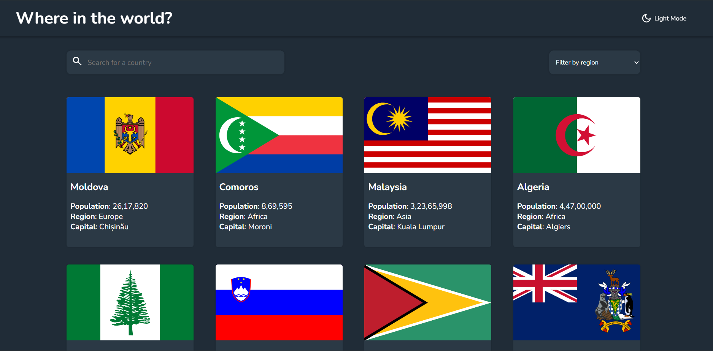

<div align="center">

# Find Your Country

Discover information about any country: flag, population, region, capital, top-level domain, currencies, languages, and bordering nations — with instant search, region filtering, and dark mode.

<p align="center">
  
  <br/>
  <em>Responsive grid, dark mode, rich country details.</em>
</p>

</div>

## 🚀 Overview
This React app consumes the public REST Countries API and lets users:
* Browse all countries in a responsive grid.
* Search by country name (client-side, case-insensitive).
* Filter by region (Africa, Americas, Asia, Europe, Oceania).
* View detailed info on a dedicated page (including native name, sub‑region, currencies, languages, and border countries with navigation links).
* Toggle Dark / Light mode (preference persisted in localStorage).

## 🧰 Tech Stack
| Layer | Tools |
|-------|-------|
| Frontend Framework | React 19 |
| Build Tool / Dev Server | Vite 7 |
| Routing | react-router-dom 7 |
| State / Context | React Context + custom hook (`useTheme`) |
| Styling | Plain CSS (component/class based) |
| Data Source | REST Countries API (https://restcountries.com) |
| Linting | ESLint 9 (React hooks & refresh plugins) |

## 📂 Key Structure
```
src/
  App.jsx            # Root provider + layout shell
  components/        # UI components (Header, lists, detail, search, filter)
  context/           # Theme context
  hooks/             # Custom hook for theme access
```

## 🌙 Dark Mode
Theme state stored in context; user selection persisted in `localStorage` (`isDarkMode`). Classes (`dark`) applied conditionally to toggle styles; SVG icon color updated dynamically.

## 🔍 Data Flow
* List page (`Home`) fetches all countries once (`/v3.1/all?fields=...`).
* Client-side filtering & searching performed in-memory (no extra API calls per keystroke).
* Detail page fetches full country by name (`/v3.1/name/{country}?fullText=true`), then resolves border country codes in parallel (`/v3.1/alpha/{code}`).

## 🧪 Error Handling
* Basic not-found fallback for invalid country names.
* Graceful handling of countries without borders (shows “No border countries”).

## ▶️ Getting Started
Install dependencies and run the dev server:
```bash
npm install
npm run dev
```
Then open the printed local URL (default: `http://localhost:5173`).

## 🔧 Scripts
* `npm run dev` – Start dev server with HMR.
* `npm run build` – Production build.
* `npm run preview` – Preview production build locally.
* `npm run lint` – Run ESLint.

## 🌐 API Reference
Base: `https://restcountries.com/v3.1`
Endpoints used:
* `/all?fields=name,flags,population,region,capital`
* `/name/{country}?fullText=true`
* `/alpha/{code}` (for each border)


## 📄 License
Personal / educational use. Add a formal license if distributing.

---
Feel free to extend this app—add favorites, offline caching, or switch to server-side search.
